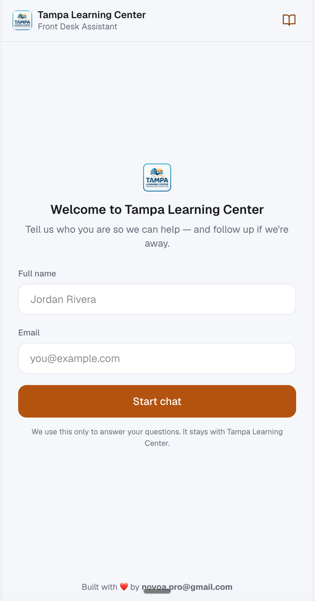
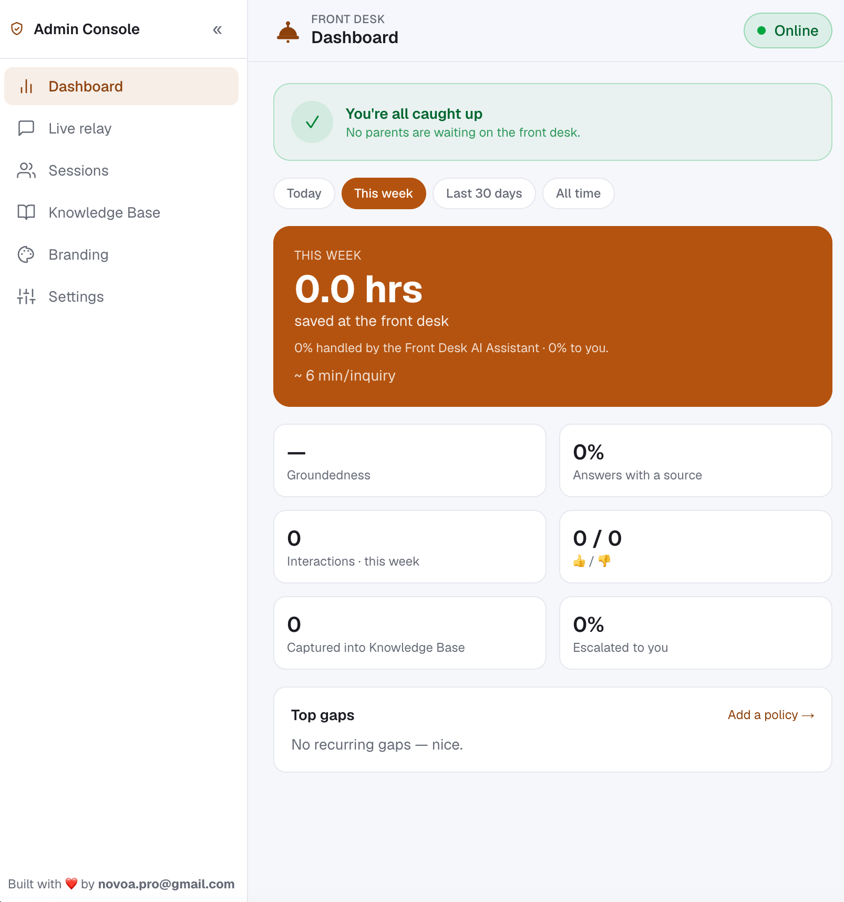
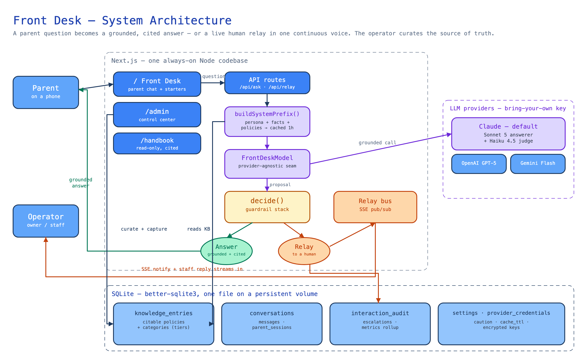
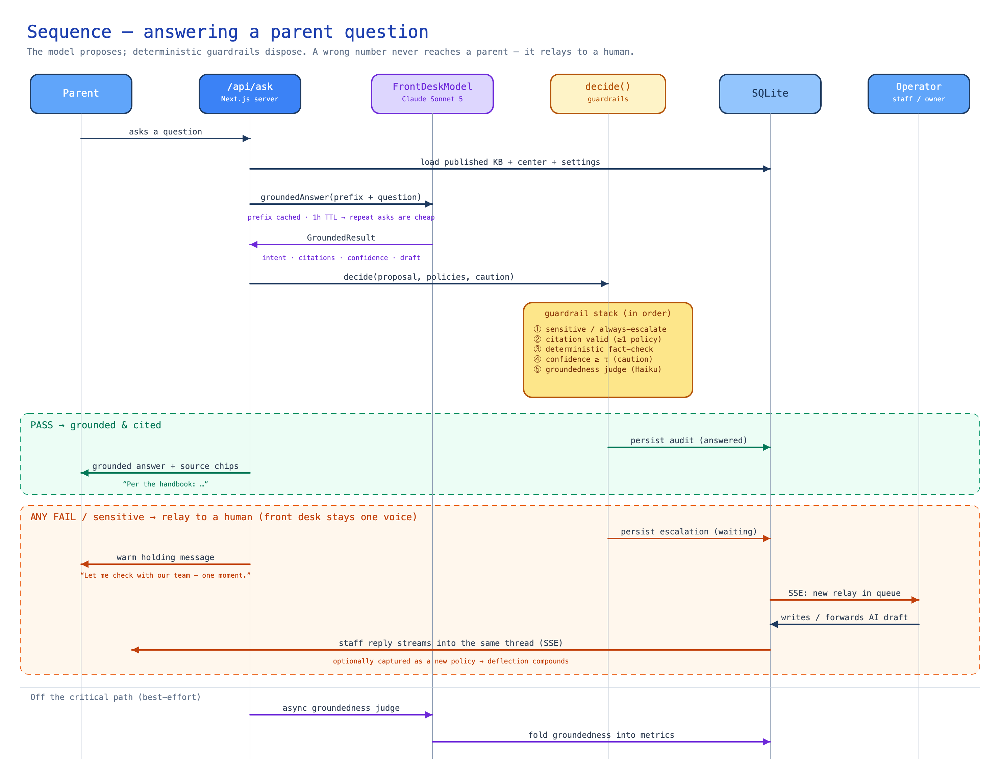
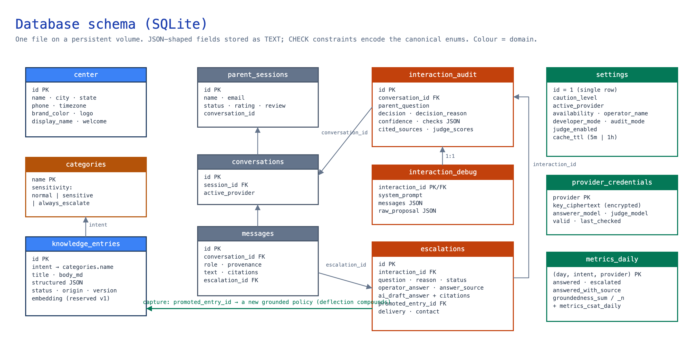
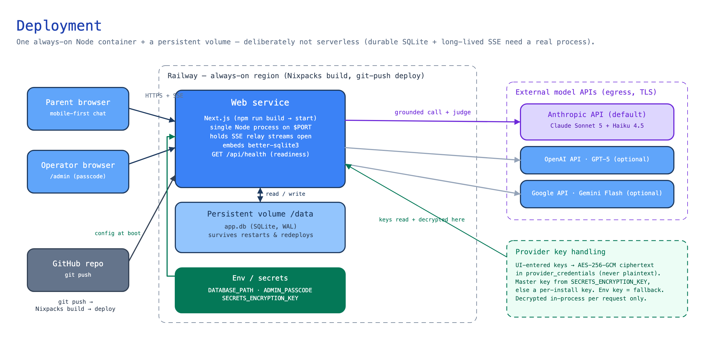

# Front Desk

> **Independent take-home project for the Brightwheel interview process — by Manuel Novoa.** It is **not** a Brightwheel product and is not affiliated with, endorsed by, or provided by Brightwheel. All data is fictional; "Brightwheel" appears only to frame the product vision the exercise asked for.

**Live demo** → **[takehome.bw.manplabs.com](https://takehome.bw.manplabs.com)** &nbsp;·&nbsp; **Operator console** → **[/admin](https://takehome.bw.manplabs.com/admin)** (passcode `change-me` — the built-in default when `ADMIN_PASSCODE` isn't set) &nbsp;·&nbsp; **Repo** → **[github.com/novoapro/brightwheel-take-home-manuel](https://github.com/novoapro/brightwheel-take-home-manuel)**

<p align="center">
  
  &nbsp;&nbsp;
  
</p>

**Front Desk** is a mobile-first proof-of-concept front desk — the kind of component a vertical-SaaS platform *could* ship across many early-education centers. Multi-tenant by design: the same code renders any center, and everything a parent sees — business name, front-desk name, logo, one accent color, welcome copy — is per-center config from the control center. One codebase renders any daycare.

### Focus: depth + novelty

The brief offered three axes to invest in — **breadth**, **depth**, **novelty**. I chose **depth** (a small set of intents handled extremely well: policy-vs-case logic, edge cases, escalation) and **novelty** (the trust-preserving live human-relay). **Breadth I deliberately let the system grow into** — more intents and answers compound on their own as operators curate the knowledge base and parents keep asking, so it's the axis experience fills in, not the one to front-load.

> **Not production-ready — by design.** Security wasn't a requirement for this exercise, so it isn't hardened: the `/admin` gate is a mock passcode, not real auth. The write-up notes where real hardening would go.

Parents get fast, **grounded, attributed** answers about hours, tuition, sick-day policy, meals, and tours; when a question is uncertain or case-specific, the front desk **relays to staff in real time** (one voice, in-thread) rather than guessing — and a staff answer can be captured into the source of truth so deflection compounds.

Two surfaces, one codebase (both on a shared, Brightwheel-inspired base look — plain background + white cards + blurple, tinted by the tenant's accent):

- **`/` — Parent front desk.** Anonymous chat with guided starters, attribution chips, and 👍/👎; branded per center.
- **`/admin` — Operator control center.** Dashboard (hours saved, containment, groundedness, top gaps), live-relay queue, source-of-truth editor, a **Branding tab** (edit everything parents see, beside a live preview), and settings (caution dial + provider toggle). Gated by a mock passcode.
- **`/handbook` — Read-only family handbook**, derived from the published policies the assistant cites.

The full design lives in [`analysis/`](analysis/) (stages 00–11; stage 10 covers the component reframe + per-center theming, stage 11 the provider config + availability); [`CLAUDE.md`](CLAUDE.md) is the working brief.

## Stack

- **Next.js** (App Router, TypeScript) · **Tailwind CSS** — one codebase for the mobile-first UI and the server logic
- **SQLite** via `better-sqlite3` (one file on a persistent disk; migrations run on connect)
- **LLM:** a provider-agnostic `FrontDeskModel` seam — **Claude Sonnet 5** answerer + **Haiku 4.5** judge (`@anthropic-ai/sdk`) by default, with **OpenAI GPT-5** and **Gemini Flash** as A/B toggles
- **Real-time relay:** Server-Sent Events (SSE), held open by the always-on Node process

The two stateful needs — **durable SQLite writes** and a **long-lived SSE stream** — are why this runs as an always-on Node server with a persistent volume, not on ephemeral serverless. See [`analysis/08`](analysis/08-architecture-and-stack-review.md) for the full rationale.

## Architecture

Four views of the system. The editable Excalidraw sources live in [`docs/diagrams/`](docs/diagrams/).

### System architecture

A parent question flows through the **trust core** — a cached grounding prefix, the model, then a deterministic guardrail wrapper — and comes out as either a grounded, cited answer or a live human relay. The operator curates the source of truth, which feeds the cache; a relayed answer can be captured back into it.



### Answering a question — the guardrails

The model *proposes*; deterministic code *disposes*. Every proposal runs the guardrail stack in order, and **any** failure (or a sensitive topic) routes to a human instead of the parent. A wrong number can never reach a parent.



### Database schema

One SQLite file, coloured by domain: the source of truth (`knowledge_entries` + `categories`), the chat (`parent_sessions` → `conversations` → `messages`), the audit/relay trail (`interaction_audit`, `escalations`), and operator config (`settings`, `provider_credentials`). The green **capture edge** (`escalations.promoted_entry_id` → `knowledge_entries`) is how deflection compounds.



### Deployment



### The AI stays in the loop — humans assist, they don't "take over"

The single most important product decision: when the front desk isn't certain, **the parent never sees a failure or a hand-off.** They see the same warm assistant say *"Let me check with our team — one moment,"* and a staff member's reply streams into that **same thread** moments later. There is no "I'm just a bot, transferring you," no dead end, no restart.

- Under the hood, a relay creates an escalation and the model's suppressed draft is kept as a **suggested answer** the operator can accept, edit, or forward. Whether the reply is written by staff or is the AI's forwarded draft, it arrives in one continuous voice ([`conversation.ts`](src/lib/conversation.ts), [`relay/answer.ts`](src/lib/relay/answer.ts)).
- A bare *"okay"* / *"thanks"* while a human is already relaying is kept in-thread — no second "checking with our team," no re-escalation ([`isAcknowledgment`](src/lib/relay/acknowledgment.ts)).
- The effect: the parent trusts **the assistant**, and the human is invisible backup that raises quality — not a sign the AI failed. This is what makes deflection safe to lean on.

### Guardrails — the model proposes, code disposes

The trust guarantee is a **deterministic wrapper** around the model call ([`guardrails/decide.ts`](src/lib/guardrails/decide.ts)). Order matters — the first failure short-circuits to a relay:

1. **Sensitivity routing** — a category the operator marked `always_escalate` never answers; any case-specific question in a sensitive category relays (policy = answer, *case* = escalate).
2. **Citation validity** — the answer must cite ≥ 1 *published* policy id, or it relays.
3. **Deterministic fact-check** — every number, date, time, and price in the answer must appear in a cited policy ([`guardrails/facts.ts`](src/lib/guardrails/facts.ts)). This is the differentiator: a hallucinated pickup time is caught by code, not vibes.
4. **Confidence gate** — the model's self-reported grounding must clear a threshold τ that rises with the operator's caution dial and with sensitivity.
5. **Groundedness judge** — a cheap **Haiku 4.5** pass scores support from the sources, always for sensitive answers and for the borderline confidence band. (Off-path, a second judge run feeds the dashboard.)

Category **sensitivity tiers** (`normal` / `sensitive` / `always_escalate`) are operator-owned data on the `categories` table, not hard-coded — the same taxonomy drives both routing and the confidence bar.

### The knowledge base & the cached system prompt

The source of truth is a set of small, atomic, **citable** `knowledge_entries` — each a titled policy with a Markdown body, a typed `structured` JSON payload (the exact hours / prices / thresholds), keywords, a `published`/`draft` status, and a `seed`/`captured` origin. Every **published** entry, plus the center's facts and the assistant's persona, is concatenated (id-sorted, so it's byte-stable) into one **system prefix** ([`model/prompt.ts`](src/lib/model/prompt.ts)).

That prefix is identical for every parent and rarely changes, so it's sent as a **prompt-cached** block. The cache TTL is an operator setting (**Settings ▸ AI Assistant ▸ Handbook cache**, `settings.cache_ttl`), defaulting to **1 hour**:

- **Why cache the whole handbook instead of retrieval/RAG?** At this scope — one independent center, a handbook of dozens of entries (a few thousand tokens) — the entire source of truth fits comfortably in context. Structured grounding over the full, cited handbook is simpler, cheaper, and more reliable than an embedding pipeline, and answer quality is what matters here, not document-ingestion sophistication.
- **Why a 1-hour TTL?** Front-desk traffic is bursty — clustered around drop-off and pick-up, quiet in between. The API's default 5-minute cache would expire during the quiet gaps and re-bill the (large) handbook prefix on the next question; 1 hour keeps it warm across the natural cadence of a day. Crucially, when the operator edits a policy the prefix **bytes change and the cache invalidates on its own** — so a longer TTL never trades away freshness. `5m` remains available for a shorter window.
- **Migration path.** When corpora outgrow a single cached prefix (many centers, large multi-document handbooks), move to **retrieval**: `knowledge_entries.embedding` / `escalations.question_embedding` are already reserved BLOB columns for a **Postgres + pgvector** layer that selects only the relevant policies per question. The provider seam, the guardrail wrapper, and the audit trail are all unchanged by that swap.

## Prerequisites

- **Node.js 20+** (uses native `better-sqlite3`; developed on Node 20–25)
- An llm key for live answers. Anthropics, OpenAI or Google.

## Getting started

```bash
npm install
cp .env.example .env.local     # optional — all keys can also be set in the admin UI
npm run db:migrate             # apply the schema (also runs automatically on first connect)
npm run db:seed                # seed Little Acorns policies + a week of history (idempotent)
npm run dev                    # http://localhost:3000
```

- Open **`/`** for the parent chat and **`/admin`** for the operator (passcode = `ADMIN_PASSCODE`, default `change-me`).
- No API key in the environment? The primary path is **Settings → AI provider** in `/admin`: paste a key per provider and it's stored encrypted at rest. The env vars below are only a bootstrap fallback so `npm run dev` answers before you open the UI.
- Health check: **`GET /api/health`** returns DB path, schema version, and entry count.

### Environment variables

All are **optional** — the app boots without them and provider keys can be entered in the admin UI. Set them in the environment for production/CI.

| Variable | Purpose | Default |
|---|---|---|
| `ANTHROPIC_API_KEY` | Claude Sonnet 5 answerer + Haiku 4.5 judge (default provider) | — (bootstrap fallback) |
| `OPENAI_API_KEY` | OpenAI GPT-5 provider (optional A/B toggle) | — |
| `GOOGLE_API_KEY` | Gemini Flash provider (optional A/B toggle) | — |
| `FRONTDESK_PROVIDER` | First-boot default provider (`anthropic` / `openai` / `google`). Bootstrap only — a provider chosen in `/admin` is stored in the DB and overrides it. | `anthropic` |
| `FRONTDESK_MODEL` | First-boot default answerer model for the selected provider (validated against its registry; ignored if not valid for that provider). A UI-stored model choice overrides it. | provider default |
| `SECRETS_ENCRYPTION_KEY` | Master key (AES-256-GCM, 32-byte base64) for encrypting UI-entered provider keys at rest. Auto-provisions per-install if unset; **set it in production** so the key lives outside the DB. Generate: `node -e "console.log(require('crypto').randomBytes(32).toString('base64'))"` | auto-provisioned |
| `DATABASE_PATH` | SQLite file location; point at the mounted volume in production (e.g. `/data/app.db`) | `./data/app.db` |
| `ADMIN_PASSCODE` | Mock operator gate for `/admin` (not real auth — a non-goal) | `change-me` |

## Commands

```bash
npm run dev         # local dev server (http://localhost:3000)
npm run build       # production build
npm run start       # run the built app (after npm run build)
npm run lint        # eslint
npm run test        # unit tests (guardrails, escalation gate, fact-checker, repos, metrics)
npm run test:watch  # unit tests in watch mode
npm run eval        # golden regression suite (needs ANTHROPIC_API_KEY; EVAL_PROVIDER=anthropic|google)
npm run db:migrate  # apply the SQLite schema
npm run db:seed     # seed policies + historical interactions (idempotent)
```

### Testing

`npm run test` runs the [Vitest](https://vitest.dev) suite — the business logic (grounding wrapper, escalation/decision gate, deterministic fact-checker, repositories, metrics rollup). Tests are colocated (`*.test.ts`) and use an in-memory SQLite DB, so they need **no API key or network** and run fast.

Two suites do reach the real models and are **opt-in** (they need a provider key):

```bash
npm run eval                            # graded golden suite: groundedness, decision, escalation P/R, facts
                                        #   (requires ANTHROPIC_API_KEY; EVAL_PROVIDER=anthropic|google)
RUN_LLM_IT=1 ANTHROPIC_API_KEY=… npm test   # live-model integration test
```

These require the key **in the environment** (not the admin UI): both run as standalone CLI scripts outside a running server, on a fresh in-memory DB, so there are no UI-stored encrypted credentials for them to read — the key can only come from `ANTHROPIC_API_KEY`. The deployed app is the opposite: it reads the UI-entered key first and treats env as a fallback.

## Deployment

The app is a **standard Next.js server** with two stateful needs — **durable SQLite writes** (the operator's compounding loop) and a **long-lived SSE stream** (the live staff relay). So it runs on any **always-on Node host with a persistent volume**, and is deliberately *not* a fit for ephemeral serverless functions (which lose the SQLite file between invocations and can't hold the SSE connection open).

**What any host needs to provide:**

1. **A long-running Node process** (not per-request functions) — so the SSE relay stream stays open.
2. **A persistent volume** mounted at a stable path — so the SQLite file survives restarts and deploys.
3. **Build + start:** `npm run build` then `npm run start` (Next serves on `$PORT`).
4. **Env vars** from the table above — at minimum `DATABASE_PATH` pointed at the volume, `ADMIN_PASSCODE`, and `SECRETS_ENCRYPTION_KEY`; a provider key via env or the admin UI.
5. **Health check** at `GET /api/health` for the platform's readiness probe.

### Railway (recommended — git-push deploy)

Chosen host ([`analysis/08 §4`](analysis/08-architecture-and-stack-review.md)): near-Vercel DX with the container model this app actually needs.

1. Create a project → **Deploy from GitHub repo** (Railway auto-detects Next.js via Nixpacks; no Dockerfile needed). Build = `npm run build`, start = `npm run start`.
2. Add a **Volume** to the service, mounted at `/data`.
3. Set **Variables**: `DATABASE_PATH=/data/app.db`, `ADMIN_PASSCODE`, `SECRETS_ENCRYPTION_KEY`, and `ANTHROPIC_API_KEY` (or add keys in the admin UI after first boot).
4. Push to the connected branch → Railway builds and deploys automatically. Optionally set the healthcheck path to `/api/health`.
5. First deploy: schema migrates on first DB connect. To load the demo center, run `npm run db:seed` once against the volume (Railway shell / one-off command) — or leave it empty and configure the center from `/admin`.

### Alternative hosts

Same requirements, so the app ports cleanly:

- **Render** — reliability-first equivalent. Create a **Web Service** from the repo, add a **Persistent Disk** mounted at `/data`, set the same env vars, build `npm run build` / start `npm run start`.
- **Fly.io** — most control. `fly launch` (add a `[mount]` volume for `/data`, set `PORT`), `fly secrets set …` for the env vars, deploy via the generated Dockerfile.
- **Any VPS / container platform** (a plain Docker container, ECS, etc.) — run `npm ci && npm run build && npm run start` with `/data` on a mounted volume and the env vars set.

### Migration path at scale

The stack is intentionally scrappy but migratable: SQLite → **Postgres/pgvector**, and the single-process SSE relay → a **managed realtime service** (Ably / Convex / Supabase Realtime) when you outgrow one container. Both are documented in [`analysis/08`](analysis/08-architecture-and-stack-review.md).

---

All data is fictional (the invented **Little Acorns Early Learning Center**); no real personal data is used.
